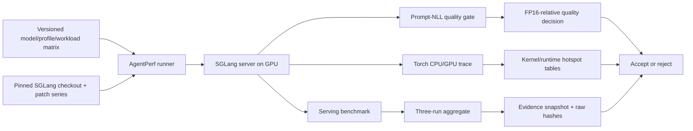

# SGLang-AgentPerf

[](https://github.com/Biaogezi/sglang-agentperf/actions/workflows/ci.yml)
[](LICENSE)

Profiling-driven optimization of quantized agentic LLM serving on the real SGLang runtime.

This repository is the experiment and evidence layer for an upstream SGLang optimization
project. It deliberately does **not** reimplement paging, radix caching, scheduling, or an LLM
runtime. Runtime changes live as reviewable patches against a pinned SGLang checkout; this repository
owns workload definitions, launch configurations, profiling automation, result validation, and
performance reports.

**A10 v1 is complete:** the scoped 128-input/1-output/concurrency-one native-ID result improves
throughput by **13.15%** under matched no-overlap settings. A separate graph-covered high-batch
decode experiment gives **+7.40%**, below the pre-registered acceptance gate. Core and multi-turn
workloads show no meaningful general speedup. Read the [final report](docs/FINAL_REPORT.zh-CN.md),
[delivery checklist](docs/PROJECT_STATUS.zh-CN.md), and [resume description](docs/RESUME.zh-CN.md)
for evidence and limits. `python scripts/verify_primary_result.py` reconstructs the primary claim
from public request-level artifacts without a GPU.

## Research question

For long-prefix, multi-turn agent workloads on a 24 GiB NVIDIA A10, where does time go after
weight quantization, and which SGLang runtime change improves end-to-end latency or throughput
without unacceptable quality loss?

The first profiling pass evaluates three hypotheses:

1. CUDA Graph bucket coverage and padding are inefficient for bursty agent batch shapes.
2. Quantized linear backends have shape-dependent crossovers that static selection misses.
3. Long prefills interfere with latency-sensitive decode and need SLO-aware chunk control.

Only a bottleneck demonstrated in a trace becomes an optimization target.

## Evaluation contract

- Primary GPU: NVIDIA A10 24 GiB (SM 86).
- Primary model: Qwen3-8B.
- Validated model: Qwen3-8B only; secondary models are future work.
- Measured precision paths: FP16, calibrated W8A8 INT8, AWQ-Marlin INT4.
- Workloads: decode-bound, prefill-bound, generated shared-prefix, and tool-calling replay.
- Metrics: p50/p95/p99 TTFT, TPOT and ITL; request/token throughput; HBM; cache hit rate;
  CUDA Graph coverage; CPU/GPU/kernel time.
- Accepted serving comparisons use warmup plus at least three measured repetitions.
  GPU correctness, quality scoring and dispatch-proof traces are separately labelled checks.
- A change is retained only if it improves throughput by >=10%, p99 TTFT/TPOT by >=15%, or
  capacity by >=20%. The operational numerical gate is mean NLL increase <=0.02 on identical
  tokens, with no lost correct answers in the fixed task regressions; this is not a broad
  model-capability guarantee or a claim of standard WikiText perplexity.

## Layout

```text
configs/                 versioned models, server profiles and workload matrix
patches/                 reviewable runtime changes; rejected candidates remain default-off
src/agentperf/           pure-Python plan builder, runner and result summarizer
scripts/                 remote bootstrap, environment capture and Nsight helpers
tests/                   CPU-only validation for orchestration and result logic
docs/                    experiment protocol, profiling checklist and decision log
upstream/sglang/          ignored checkout of the pinned SGLang revision
results/ and profiles/   ignored generated evidence
```

## Experiment flow



Each optimization starts from a trace-backed hypothesis. Static controls and the source candidate
run through the same matrix; a candidate is accepted only when it clears both performance and
quality gates. Rejected experimental patches remain reviewable and default-off, not advertised
as accepted acceleration.

## Local preparation

```bash
python -m venv .venv
source .venv/bin/activate
pip install -e '.[dev]'
agentperf validate --config configs/experiment_matrix.json
agentperf plan --config configs/experiment_matrix.json --suite smoke
pytest
```

On Windows, activate with `.venv\Scripts\Activate.ps1`.

## GPU host bootstrap

After copying this repository to the Ubuntu GPU host, experiments run in a digest-pinned SGLang
CUDA 12.9 development image. The NVIDIA driver remains external to the container:

```bash
bash scripts/bootstrap_remote.sh
cp configs/host.env.example .env
# Edit .env to point to downloaded model directories.
bash scripts/run_gpu_smoke.sh
```

Run the smoke gate before downloading every quantized checkpoint or launching the full matrix.

`w8a8_int8` requires an already calibrated, per-channel INT8 checkpoint. Pointing that flag at
ordinary FP16 weights can produce plausible throughput with unusable output; `run-quality` is the
mandatory gate before any W8A8 performance result is accepted.

To publish a compact, auditable result without committing multi-megabyte request traces, use
`agentperf snapshot-evidence`. It copies the manifest plus either the benchmark aggregate CSV or
the quality JSON, and records the size and SHA-256 of every ignored raw artifact.
`agentperf snapshot-trace-evidence` publishes the compact profiler tables while recording the
size and SHA-256 of the ignored raw trace.

## Evidence policy

No percentage enters the README or resume unless the raw SGLang JSONL output, launch command,
environment manifest, pinned commits, and at least three repetitions are present. Kernel-only
results are labelled kernel-only. Simulator results are never presented as end-to-end latency.

## Current findings

- Quality gates now use 8,128 scored tokens, superseding the earlier 335-token smoke. Expanded
  FP16 NLL is 2.94421; AWQ is 3.02027 and **fails** the unchanged +0.02 numerical gate.
  Preserve AWQ's timing data as a quality/performance trade-off, not lossless acceleration.
  The source candidate uses calibrated W8A8 and a separate same-checkpoint OFF/ON test.
- Quantization has a measured phase crossover on the A10: AWQ-Marlin is 8.9% faster than W8A8 in
  decode output throughput, while calibrated W8A8 is 59.6% faster than AWQ on 8K-prefill input
  throughput and cuts p99 TTFT by 23.6%. These historical text-roundtrip workloads have nominal,
  not exact, input lengths. Quantization recipes are checkpoint authors' work, not ours. See the
  [quantization crossover report](docs/QUANTIZATION_CROSSOVER.md).
- AWQ-Marlin removes the A10 KV-capacity failure mode seen in the FP16 load test and materially
  improves decode-bound and shared-prefix serving.
- The extra KV capacity exposes long-prefill/decode interference: default AWQ reaches high input
  throughput but poor streaming tail latency on the 8K workload.
- A measured static 1024-token chunk profile reduces p99 TPOT by 72.9% at a 7.8% input-throughput
  cost. The first adaptive source patch did **not** beat that tuned static control and was rejected.
- On calibrated W8A8, the same static 1024-token operating point reduces p99 E2E by 21.9%, p99
  TPOT by 63.2%, and p99 ITL by 92.2% at a 21.5% input-throughput cost versus W8A8's default.

See [Optimization 001](docs/OPTIMIZATION_001_SLO_CHUNKING.md) for absolute values, controls, and
the negative-result decision.

The first bounded CPU+GPU trace shows 98.25% GPU activity and attributes 77.7% of kernel time to
AWQ-Marlin variants. See [Profile 001](docs/PROFILE_001_AWQ_MIXED_PREFILL.md) for the hotspot table
and next hypothesis.

Calibrated W8A8 traces attribute 64.7% of mixed-prefill and 77.9% of batch-one decode kernel time
to CUTLASS INT8 GEMM. Separate dynamic activation quantization plus RMSNorm account for only 5.7%
and 3.5%, respectively. See [Profile 002](docs/PROFILE_002_W8A8_KERNELS.md) for the phase-separated
analysis and optimization selection decision.

A Triton candidate fuses RMSNorm with dynamic per-token INT8 quantization and improves the
standalone operator pair by 31.5%–110.3%. A subsequent dispatch audit found that the historical
serving runs selected a different quantization method, so their switch was a no-op: those runs
do **not** establish fusion quality or performance. The candidate remains default-off, and new
experiments require positive GPU-trace proof of execution. See
[Optimization 003](docs/OPTIMIZATION_003_W8A8_NORM_QUANT_FUSION.md).

The resulting FP16-reduction experiment did not improve the trace-relevant 8K workload and changed
long-sequence outputs, so it was rejected. See
[Optimization 002](docs/OPTIMIZATION_002_MARLIN_REDUCTION.md).

The SM86 short-prefill INT8 GEMM candidate has exact GPU correctness, quant-method fallback
tests, bounded row-count JIT variants and positive serving-trace dispatch proof. With the same
existing no-overlap latency setting on both arms, its first three-round native 128-input-token,
one-output-token, concurrency-one test improved throughput 12.08%; the final-source retest gives
**13.15%** (4143.97 to 4688.91 input tok/s), with p99 TTFT 31.705→28.115 ms. This clears the
unchanged 10% gate only for that measured regime, not arbitrary agent traffic. With 32 output
tokens at concurrency one, throughput gain is only 0.27% at 128 input tokens. Final quality
passes (+8.466e-7 same-checkpoint NLL delta, all 40 task texts unchanged). Three-round core
regressions complete all 2,400 requests with throughput changes within ±0.3%; shared-prefix text
matches 468/480 pairs rather than all pairs. Multi-turn replay completes all 576 turns with
essentially unchanged output throughput; 259/288 paired texts match, so later histories can differ.
Graph-covered high-batch decode separately improves output throughput by 7.40% over three pairs,
below the unchanged 10% gate; independent traces prove execution in both eager and graph modes.
See [Optimization 007](docs/OPTIMIZATION_007_BATCHED_DECODE.md),
[Optimization 006](docs/OPTIMIZATION_006_LATENCY_CONTROL.md) and the full experiment history in
[Optimization 004](docs/OPTIMIZATION_004_SM86_INT8_PREFILL.md).

The native W8A8 norm-fusion dispatch is now repaired and execution-proven. The combined candidate
improves default-overlap 128-token throughput by 9.02%, below the gate, and changes some greedy
answers. Norm fusion remains OFF in the selected GEMM-only candidate. See
[Optimization 005](docs/OPTIMIZATION_005_NATIVE_W8A8_FUSION.md).

Current consolidated results: [A10 experiment report](docs/FINAL_REPORT.zh-CN.md).
Readers can independently recompute the primary throughput and TTFT numbers from the
[published per-request metrics](docs/EVIDENCE_GUIDE.md), not only trust summary percentages.

For a Chinese walkthrough of architecture, implementation ownership and interview questions, read
[项目讲解与面试准备](docs/PROJECT_GUIDE.zh-CN.md).
The evidence-bound [Chinese resume description](docs/RESUME.zh-CN.md) keeps the workload and
hardware qualifiers attached to each accepted result.
