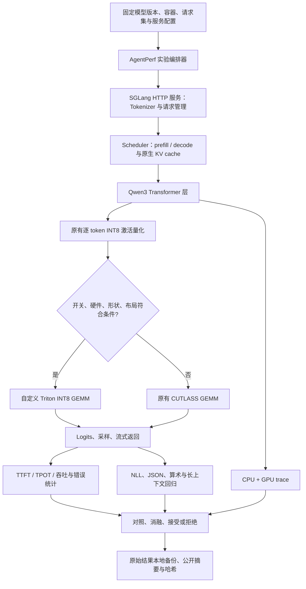

# SGLang-AgentPerf：项目讲解与面试准备

## 一句话说明

这是在真实 SGLang 上做的量化推理性能工程项目：先定位 A10 上不同负载的瓶颈，再写
可关闭、可回退的运行时补丁，用同条件服务测试和质量回归决定是否保留。

它不是从零写推理引擎。分页 KV cache、Radix 前缀缓存、continuous batching、FlashInfer、
Marlin 和 CUTLASS 都来自上游。自己的工作是实验系统、瓶颈分析、补丁、测试及证据链。

## 系统框架

请求流程：先把 prompt 转为 token；调度器分配 KV 空间并组织 prefill；模型逐层算出下一 token
的 logits；随后不断执行 decode；最后将结果返回并释放请求占用的资源。我们主要修改线性层计算
和做实验，不改变这套上游请求生命周期。

## 已做的工作及归属

| 工作 | 自己实现了什么 | 不应如何描述 |
|---|---|---|
| 可复现实验平台 | 配置校验、服务生命周期、重复测试、日志、摘要、质量门槛、原始文件哈希 | 不等于写了一个新推理引擎 |
| 量化部署与分析 | 校验 checkpoint，比较 FP16 / 已校准 W8A8 / AWQ-Marlin 的容量与阶段性能 | 没有自行发明 AWQ、Marlin 或校准第三方 W8A8 模型 |
| 分块 prefill 调优 | 静态参数对照和一个自适应调度源码候选 | 静态配置收益不是自己发明 chunked prefill |
| Marlin 精度实验 | 可控归约精度开关、输出与性能比较 | 未通过的候选不能写成上线优化 |
| RMSNorm + INT8 量化融合 | Triton 融合算子及单算子测试 | 旧服务测试走错路径，不能作为融合服务收益或无收益的证据 |
| 形状感知 INT8 GEMM | 自定义整数矩阵乘与缩放 epilogue，双量化路径接入、守卫与回退 | 只对已测硬件、形状有效，微测提升不是端到端提升 |

具体结论以各 `OPTIMIZATION_*.md` 的最终状态和对应 `evidence/` 为准。

## 自定义 GEMM 到底改了什么

W8A8 表示权重和参与矩阵乘的激活都用 INT8 表示。一个输出元素近似为：

`Y[m,n] = FP16_or_BF16(INT32_dot(Aq[m,:], Wq[:,n]) * (activation_scale[m] * weight_scale[n]))`

不是用 INT8 保存累加结果。长度 K=4096 时，INT8 乘积先累加到 INT32，避免很快溢出。
然后按 token 和输出通道恢复尺度，最后转换输出类型。

kernel 每个 CTA 负责 128×128 的输出块，每次沿 K 读取 128 个元素。Triton 将 `tl.dot`
映射到 Tensor Core 整数 MMA。M 不是 128 整数倍时通过 mask 处理边界。缩放与可选 bias 放在
同一 kernel 的末尾，避免再启动一个独立后处理 kernel。原有 CUTLASS 也有融合 epilogue，
因此不能把“融合后处理”本身称为相对基线的独家创新；真正比较的是 tile、流水线和分派选择。

先扫描形状，再用相邻未参与选择的 M 验证。范围外常常更慢，所以默认关闭，只在符合条件时
采用候选。测试中要求与原有矩阵乘逐元素完全相等，并进一步跑真实模型输出回归。

## 常见面试问答

### 1. 这与复现一个 nano-vLLM 有什么区别？

我没有重写基础引擎。我在真实 SGLang 上修改调用路径和算子，考虑现有量化格式、CUDA Graph、
回退路径与配置兼容性；服务测量还包含调度、模型执行、HTTP 与输出返回的影响。

### 2. SGLang 已经优化很多了，你的贡献在哪里？

通用后端不保证每一种硬件和矩阵形状都最优。我针对明确的 A10、Qwen3 形状做测量和分派，
但不宣称普适最优。另一个贡献是把“实际执行、正确性、微测、服务、质量”做成可审计的验证流程。

### 3. 为什么 INT4 未必比 INT8 快？

权重位宽减少有利于降低访存量和释放 KV 容量，但 INT4 路径还有解包、尺度处理和不同计算实现。
小 batch decode 与大 prefill 的算术强度不同，所以应分开比较。我的已测部署点确实出现
AWQ decode 更快、W8A8 prefill 更快的交叉，详见量化对比报告。

### 4. 你实现了量化算法吗？

没有发明量化算法，也没有将别人的校准结果写成自己的。项目使用固定版本量化 checkpoint，
校验量化元数据、文件哈希与数值质量，自己的新算子消费既有 INT8 张量和尺度。

### 5. 为什么不能把普通 FP16 权重配上 `w8a8_int8` 就测试？

该路径要求相应格式的已校准权重和尺度。不兼容的 checkpoint 可能能加载甚至跑得很快，
但输出没有意义。因此性能测量必须先过模型格式校验和数值/输出 smoke gate。

### 6. prefill 和 decode 的瓶颈有何不同？

prefill 同时处理多行输入，矩阵乘通常能有较高数据复用；小 batch decode 每条请求每步只产生
一个 token，读权重和 KV 的成本更突出。不能拿 prefill trace 的热点比例解释所有 decode 请求。

### 7. M、N、K 是什么？

M 是这次线性层处理的 token 行数，不等于请求数量；K 是输入通道数；N 是输出通道数。
Qwen3-8B 的该测试里，QKV 合并投影是 K=4096、N=6144，gate/up 是 K=4096、N=24576。
continuous batching、分块和 CUDA Graph padding 都可能改变实际 M。

### 8. 为什么用 INT32 累加？会不会溢出？

单项最坏绝对值可达 16384。当前最大受支持 K=4096，保守界为 67,108,864，远小于 INT32 上限。
更长 K 必须重新检查范围，不能无限推广。测试还用极值输入和精确整数参考覆盖这类问题。

### 9. 逐元素相等能证明模型质量吗？

它证明被测输入上的算子一致，但不能自动覆盖布局、形状、整个模型调用和长序列累计影响。
所以还要测试真实量化 method、查看 GPU trace、比较 teacher-forced NLL 和 greedy 输出。

### 10. 为什么缩放的乘法顺序也要一致？

浮点乘法和舍入一般不满足结合律。`acc*(sa*sb)` 与 `(acc*sa)*sb` 可能产生不同舍入，bias 融合
FMA 也可能变化。为了与当前 CUTLASS 基线对齐，我保持相同顺序并禁用候选 epilogue 的浮点融合。

### 11. CUDA Graph 对这项优化有什么影响？

它减少 CPU 发射开销，但 capture 时记录了实际执行的 kernel 和地址。形状守卫可能在 capture
阶段被决定，运行时还有 bucket padding。因此必须分别检查 eager/graph 路径，不能只测 Python
函数开关。测试中的 profiling 时序不能当作无 profiling 的服务时序。

### 12. 你怎么证明优化真的被调用？

一层是直接包装实际 quant method，检查命中和回退次数；另一层是服务端 GPU trace。新候选的
对照 trace 中 `_int8_prefill` 是 ON=144 次、OFF=0 次。历史 RMSNorm 实验曾发现开关走错分派
路径，我撤回了其服务结论，并把执行证明加入门槛。

### 13. 微测提高 30%，为什么服务可能只提高几个百分点？

只优化了模型执行的一部分；CPU、attention、其他 GEMM、采样与网络没有消失。微测连续重复
同一算子，实际服务混合执行许多算子，还受数据、访存、功耗和频率影响。必须用 Amdahl 定律
作上界估计，再用完整服务测试验证，不能直接相乘或套用最佳数字。

### 14. 怎么保证公平对照？

同 checkpoint、同输入、同输出长度、同并发、同配置；独立启动和预热，按 AB/BA/AB 交替。
记录每次源码版本和开关，至少三次重复，报告绝对值与方差。profiler 只用于解释，不混入性能点。

### 15. 为什么要有 M=160 的回退对照？

它不应进入候选 kernel。如果该对照也明显变快，可能是环境、频率或其他代码变化，需要排查，
不能把差异全归功于目标算子。边界测试也检查 79/80、128/129 等分派边界。

### 16. TTFT、TPOT、ITL 有什么区别？

TTFT 是请求发出到首 token 的时间；TPOT 通常是首 token 后的平均每 token 时间；ITL 是相邻
token 的到达间隔。单输出 token 没有 TPOT/ITL，不能对零计算“改善百分比”。P99 是分位数，
不是平均值，少量请求的 P99 尤其不稳定。

### 17. 把 chunk 调小为什么可能降低吞吐？

长 prefill 被拆成更多步，给 decode 更多穿插机会，但每步计算效率和调度开销可能变差。
这是延迟与吞吐的权衡。应该说明在哪个 SLO 下采用，而不是宣传所有指标同时提升。

### 18. 自适应调度一定优于静态参数吗？

不一定。我们先实现了自适应候选，然后发现它没有胜过调好的静态对照，所以没有作为成功优化。
动态策略要考虑观测延迟、抖动、排队、稳定性和额外开销，复杂度本身不是价值。

### 19. 扩展 WikiText 测试就是标准 perplexity 吗？

不是。这里是固定版本数据的独立 128-token 窗口 NLL 回归，窗口边界和上下文处理不同于标准
拼接长文评测。数字只能与同一语料 SHA、同 token 数、同评分方式的对照比较。

### 20. JSON 和长检索测试能代表真实 agent 成功率吗？

不能。它们是可重复的应用 smoke/regression 测试，可以发现格式错误、数值变化和明显检索退化。
真实 agent 还需要工具反馈、状态管理、多轮轨迹和任务级评估，不能将 40 个检查包装成通用能力。

### 21. A10 的结论能推广到双 A100 吗？

不能直接推广。SM80 与 SM86 的资源约束不同，TP=2 还引入通信和不同局部矩阵形状。
当前硬件守卫会回退；必须在 A100 上重新 profiling、调参和端到端验证。

### 22. TP 通信量怎么估计？

先列清哪些投影需要 all-reduce/all-gather、消息张量的元素数及 dtype。以常见 ring all-reduce
为例，每 rank 理论收发各约 `2*(p-1)/p * message_bytes` 的算法通信量表达应明确统计口径；
延迟还取决于轮数、链路带宽和能否与计算重叠。本项目单卡结果没有验证多卡通信收益。

### 23. 达到最优解了吗？

没有。结论是“在给定版本、硬件、负载与搜索空间下的已测结果”。全局最优很难证明。
我可以说明比较过哪些基线、排除了哪些方案、剩余热点是什么，而不是声称没有更好的实现。

### 24. 面试官指出一个更强的上游优化怎么办？

先确认它对应的版本、硬件、精度和负载，把它加入公平对照。如果已经覆盖自己的改动，贡献
就应改为分析、复现或新场景适配；不能靠隐藏已有功能维持创新叙述。

### 25. 为什么开了融合开关还可能完全没生效？

一个量化格式可能有不同的运行时类。此前守卫只接受 compressed-tensors 的类，但命令行实际
创建的是原生 `W8A8Int8LinearMethod`。我通过检查实际类、直接调用测试和 GPU trace 发现这个
问题，撤回旧实验的因果结论，再补上 tuple 消费接口。现在必须同时检查 ON 的 kernel 存在和
OFF 的 kernel 不存在，不能用环境变量或模型配置日志代替执行证据。

### 26. 算子融合究竟少了什么？

RMSNorm 的浮点输出原本需要写回显存，量化 kernel 又读一次，并启动第二个 kernel。融合后，
归一化、absmax 和量化在同一 kernel 内完成，直接写 INT8 与 scale；下游识别预量化 tuple，
不会再量化。残差必须按原有约定写回，否则即使线性层看起来正确，整个模型也会错。

### 27. 量化边界附近为什么可能出现 1 个整数单位的变化？

归约顺序、乘法结合或浮点舍入的微小差别，可能让归一化值跨过量化舍入边界。不能因此直接
说整个模型一定错误，也不能直接忽略。我们分别检查 INT8 字节差异比例、线性层相对 L2、
模型 NLL、输出及任务退化；GEMM 的整数累加则使用更严格的逐元素相等测试。

### 28. Triton 第一次变慢与稳定运行变慢怎么区分？

记录首次调用、编译变体和热态计时。原型将每个 M 都作为编译常量，变长输入会触发很多新
编译；当前实现把 M 作为不特化的运行时参数，仅分满块和边界块。在固定 N/K/dtype/bias 下，
11 种测试 M 复用两个二进制。这个数字不是“整个模型只有两个 kernel”，也不意味着编译
优化自动转化为相对上游的稳定吞吐提升。

### 29. p99 降低可以直接写进简历吗？

先说明请求数、并发、到达速率、输出长度、冷暖缓存、重复次数以及是否采集 profiler。当前
报告的 p99 汇总是各轮 p99 的均值，不是把所有请求合并后的 p99。只有 160 请求的一轮里，
p99 由极少数尾部样本决定，不能冒充大规模生产 SLO 保证。

### 30. 固定随机 token 测试与真实 agent 有什么距离？

前者隔离计算形状，适合排查 kernel；后者存在多轮增长、前缀缓存、工具等待和输出反馈。
项目另接入上游多轮重放，使用明确标注的合成工具观察，真实模型回复进入下一轮历史。
这仍不是 SWE-bench，也不是实际工具调用成功率。两类负载分别报告，不把合成吞吐说成
agent 任务完成速度。

## 面试前亲手完成的四个练习

1. 找到 `W8A8Int8LinearMethod.apply`，画出量化、守卫、矩阵乘与输出 reshape 的路径。
2. 手算一个 2×4 乘 4×3 的 INT8 矩阵例子，解释 row/channel scale 与 INT32 累加。
3. 从一份原始 JSONL 重新算吞吐和 TTFT 分位数，对照公开摘要，解释统计口径。
4. 用一个不在支持范围的 M 跑测试，确认回退，解释为什么“少支持一点”更可靠。

代码由工具辅助完成并不等于自己已经掌握。能独立解释、修改、复测并承认边界，才是可用于面试
的项目经历。不要背诵自己无法从代码和证据解释的百分比。
